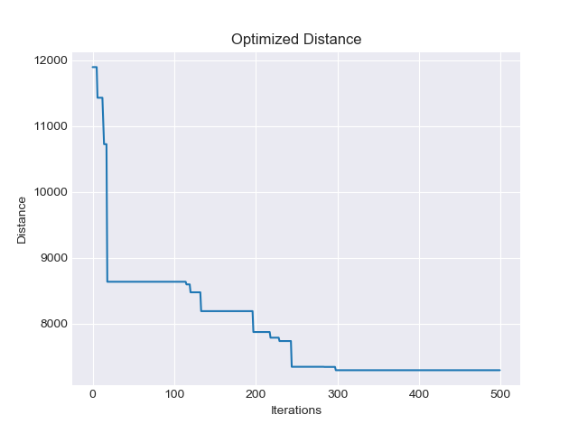

# Soma

This repository holds the code for neural networks I've implemented for my Neural Networks course at JHU. `FFBP.py` and `Boltzmann.py` are objects used to implement Feed Forward Back Propagation Networks and Boltzmann Machines, respectively.

### Feed Forward Back Propagation (FFBP) Multilayer Perceptron Network

A Feed Forward Back Propagation network can be created and trained to map inputs to outputs by learning from labeled data. The network takes the number of inputs and a "structure" of the network to initialize. For example, `FFBP.Network(2, [4, 4, 1])` would initialize a three layer network comprised of 4 Perceptrons in the first layer, 4 Perceptrons in the second layer, and 1 Perceptron in the output layer, with two inputs.

As an example, this network will be implemented to detect households with a high Targeted Advertising Code Assignment (TACA) score, using Local Affluent Code (LAC) and Size of Wallet (SOW) metrics as inputs. A sample of 20 labeled input output pairs will be used to train and test the network:

|Input (LAC, SOW)| Output (TACA)|
|---|---|
|[1.98, 10]| 0|
|[1.80, 10]| 1|
|[1.05, 160]| 2|
|[1.45, 180]| 1|
|[1.80, 80]| 1|
|[1.96, 110]| 1|
|[0.4, 40]| 2|
|[2.05, 130]| 1|
|[0.90, 10]| 1|
|[2.5, 60]| 0|
|[1.6, 105]| 2|
|[1.05, 196]| 1|
|[0.52, 105]| 2|
|[1.80, 32]| 1|
|[2.3, 106]| 0|
|[2.4, 151]| 1|
|[2.5, 170]| 1|
|[0.50, 150]| 2|
|[1.1, 35]| 1|
|[0.85, 70]| 2|

**Data Preprocessing**  
Before feeding the data into the neural network, the SOW will be normalized using [feature scaling](https://en.wikipedia.org/wiki/Feature_scaling) in an attempt to improve performance.

```python
data = [[[1.98, 10], 0],
        [[1.80, 10], 1],
        [[1.05, 160], 2],
        [[1.45, 180], 1],
        [[1.80, 80], 1],
        [[1.96, 110], 1],
        [[0.4, 40], 2],
        [[2.05, 130], 1],
        [[0.90, 10], 1],
        [[2.5, 60], 0],
        [[1.6, 105], 2],
        [[1.05, 196], 1],
        [[0.52, 105], 2],
        [[1.80, 32], 1],
        [[2.3, 106], 0],
        [[2.4, 151], 1],
        [[2.5, 170], 1],
        [[0.50, 150], 2],
        [[1.1, 35], 1],
        [[0.85, 70], 2]]

SOW = [input_output[0][1] for input_output in data]
min_sow = min(SOW); max_sow = max(SOW)
SOW_normalized = [(x - min_sow) / (max_sow - min_sow) for x in SOW]

for i, input_output in enumerate(data):
    input_output[0][1] = SOW_normalized[i]
```

**Training**  
The network will be trained using stochastic gradient descent for 5000 iterations using the second half of the sample data set. The first half of the sample data set will be used to test the network.

```python
import FFBP
x = FFBP.Network(2, [4, 2, 1])

test = data[0:10]
train = data[10:20]
iterations = 5000
eta = 1

logs = []
for i in range(iterations):
    #print('Iteration ' + str(i))
    set = []
    for input_output in train:
        x.FFBP(input_output[0], input_output[1], eta)
        set.append(int(round(x.network[2][0].activation_value, 0)))
    logs.append(set)

print('Desired Outputs:')
print([input_output[1] for input_output in train])

print('Network Output after 5000 iterations:')
print(logs[iterations-1])

print('Network Weights:')
print(x.weights)
```
**Training Output**
```
Desired Outputs:
[2, 1, 2, 1, 0, 1, 1, 2, 1, 2]
Network Output after 1000 iterations:
[2, 1, 2, 1, 0, 1, 1, 2, 1, 2]
Network Weights:
[[array([  4.54734725,  10.37713741]), array([  3.40678089, -15.08760999]), array([ 14.31164215,   0.73187886]), array([-2.91337309, -1.38728593])], [array([-6.04151   , -5.53864698, -3.63134687, -4.14375287]), array([-3.57092122, -2.41132437, -5.88344684,  0.07598259])], [array([ 4.70773123, -0.06983132])]]
```

**Testing**
```python
outs = []
for input_output in test:
    x.FFBP(input_output[0], input_output[1], eta)
    outs.append(int(round(x.network[2][0].activation_value,0)))

print('Desired Outputs:')
print([input_output[1] for input_output in test])

print('Test Data Outputs:')
print(outs)

def differences(a, b):
    return sum(i == j for i, j in zip(a, b))

matches = differences(outs, desired_outputs)
print('Matches: ' + str(matches))
```

**Testing Output**
```
Desired Outputs:
[0, 1, 2, 1, 1, 1, 2, 1, 1, 0]
Test Data Outputs:
[0, 0, 2, 1, 1, 1, 2, 1, 0, 0]
Matches: 8
```

**Results**  
After 5000 iterations of training, the network is able to separate 100% of the values correctly. After feeding the test data into the network, it was able to correctly determine the TACA value at an 80% success rate.


### Boltzmann Machine with Simulated Annealing for the Traveling Salesman Problem

A Boltzmann Machine can be created and trained to solve the Traveling Salesman Problem (TSP), which optimizes to find the shortest route connecting a list of of locations. It takes a list of location names and a distance matrix as its arguments. The row and column indices in the matrix represent each of the locations, and thus, each entry represents the distance between location. For example, in the table below, entry (0,1) represents the distance between New York and Los Angeles, which is 2451. This matrix is symmetric, since the distance from New York to Los Angeles is the same as the distance from Los Angeles to New York, or (0,1) = (1,0).

```python
import Boltzmann as boltz
import numpy as np

distances = np.array(
 [[   0, 2451,  713, 1018, 1631, 1374, 2408,  213, 2571,  875, 1420, 2145, 1972], # New York
  [2451,    0, 1745, 1524,  831, 1240,  959, 2596,  403, 1589, 1374,  357,  579], # Los Angeles
  [ 713, 1745,    0,  355,  920,  803, 1737,  851, 1858,  262,  940, 1453, 1260], # Chicago
  [1018, 1524,  355,    0,  700,  862, 1395, 1123, 1584,  466, 1056, 1280,  987], # Minneapolis
  [1631,  831,  920,  700,    0,  663, 1021, 1769,  949,  796,  879,  586,  371], # Denver
  [1374, 1240,  803,  862,  663,    0, 1681, 1551, 1765,  547,  225,  887,  999], # Dallas
  [2408,  959, 1737, 1395, 1021, 1681,    0, 2493,  678, 1724, 1891, 1114,  701], # Seattle
  [ 213, 2596,  851, 1123, 1769, 1551, 2493,    0, 2699, 1038, 1605, 2300, 2099], # Boston
  [2571,  403, 1858, 1584,  949, 1765,  678, 2699,    0, 1744, 1645,  653,  600], # San Francisco
  [ 875, 1589,  262,  466,  796,  547, 1724, 1038, 1744,    0,  679, 1272, 1162], # St. Louis
  [1420, 1374,  940, 1056,  879,  225, 1891, 1605, 1645,  679,    0, 1017, 1200], # Houston
  [2145,  357, 1453, 1280,  586,  887, 1114, 2300,  653, 1272, 1017,    0,  504], # Phoenix
  [1972,  579, 1260,  987,  371,  999,  701, 2099,  600, 1162,  1200,  504,   0]] # Salt Lake City
  )
cities = ['New York', 'Los Angeles', 'Chicago', 'Minneapolis', 'Denver', 'Dallas', 'Seattle',
          'Boston', 'San Francisco', 'St. Louis', 'Houston', 'Phoenix', 'Salt Lake City' ]

x = boltz.Boltzmann(cities, distances)
x.train(500)
```

With output:
```shell
Optimized Route: Dallas -> St. Louis -> New York -> Boston -> Chicago -> Minneapolis -> Denver
-> Salt Lake City -> Seattle -> San Francisco -> Los Angeles -> Phoenix -> Houston -> Dallas
Distance: 7293
```


This example is captured in the `examples/Boltzmann_example_2.py` script
